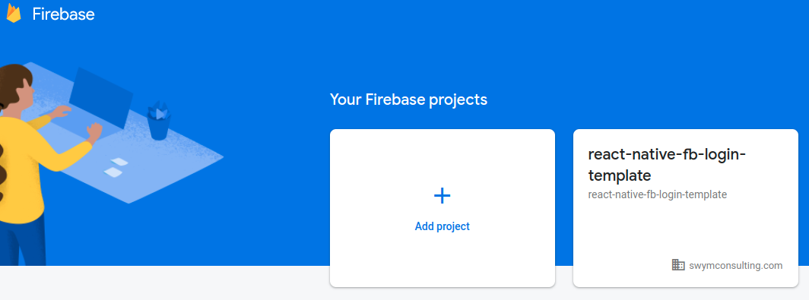
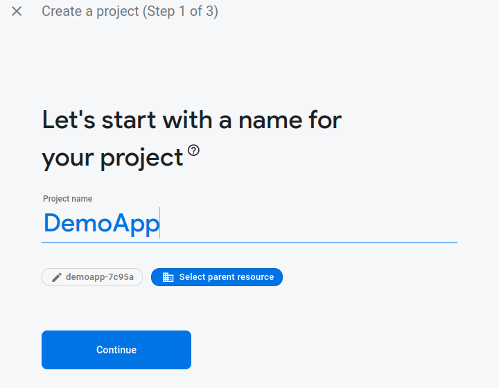
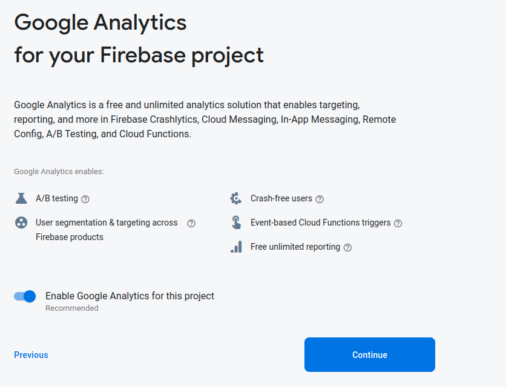
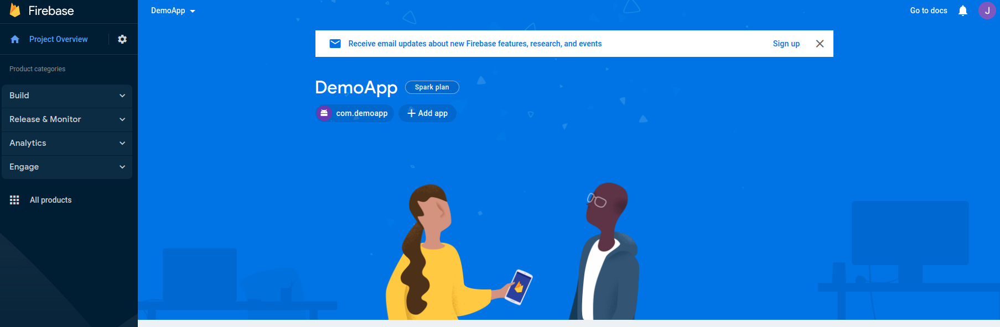
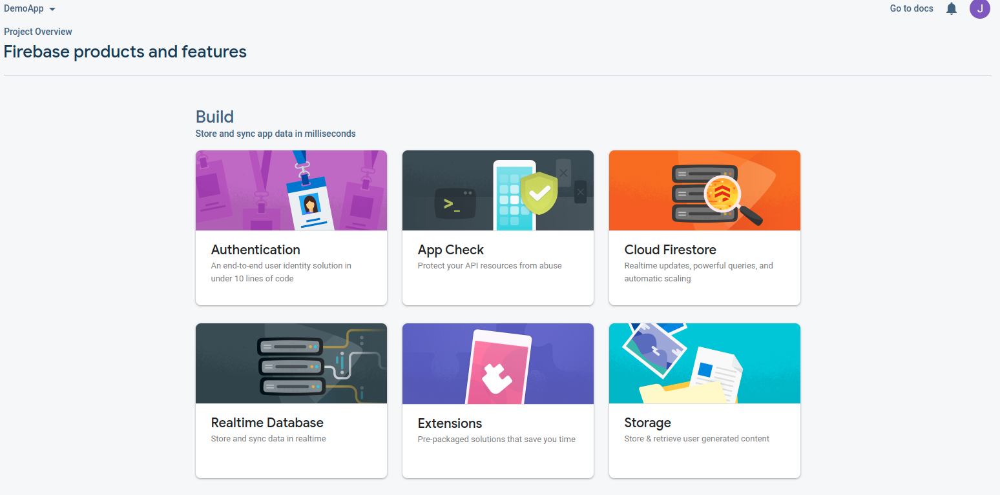
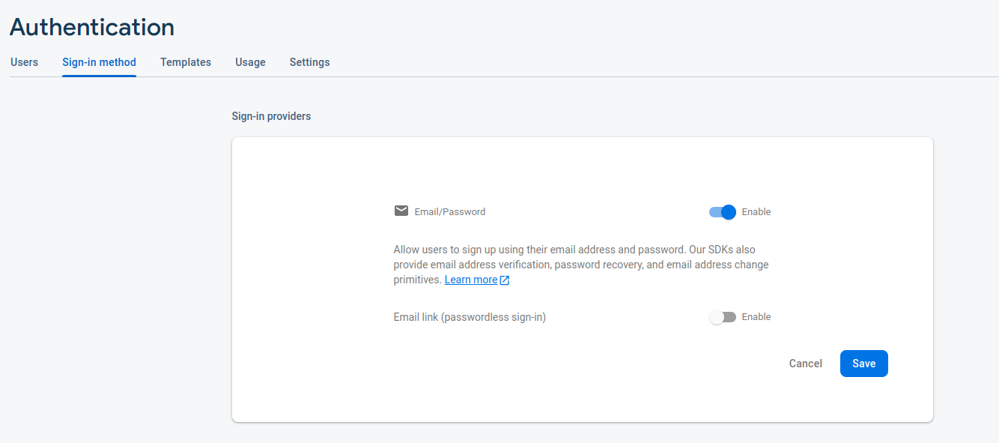

# React Native Firebase Login Template

This repository contains a template for React Native that includes a splash screen, login, registration, and password recovery pages, which then redirect to an application entry point. This removes the necessity to "reinvent the wheel" every time an app needs an email login UI.

## Installation

To start a React Native Project with this template, run the command:

```bash
npx react-native init MyAppName --template https://github.com/jhardyswym/rn-firebase-login-template.git
```

# Setting Up Firebase

A bit of Firebase Configuration is needed to get Login up and running. (This guide assumes you've already created a Firebase account).

By default, this template uses a pre-configured Firebase app, however you must configure this for your application by performing the following steps:

Login to your Firebase [console](https://console.firebase.google.com/)

Click Add Project


Next, Name your project and hit continue


Select Analytics as on and hit create app


In the next screen select the default account and hit continue.

After it creates your project, select continue and you'll be presented with the console screen.

## Android Setup
In the Firebase Console home screen, click the Android Icon. Follow the steps 1 & 2 provided by Google, ensuring that you use the same "com.xxxx" package name that matches line 137 of android/app/build.gradle and you replace the google-services.json file that is already in android/app. Ignore the SHA-1 hash, it is not needed for this template.

Steps 3 and 4 here can be ignored as this template already takes care of them for you!


Next, in console home, select all products


Now Select Authentication -> Get Started



Now under Sign in Methods -> Email/Password Enable Sign in and Save.



Congrats! You should be able to register and sign in under your Firebase account now!

To Run:

```bash
rm -rf android/app/build

npx react-native start
```

And in a seperate terminal:

```bash
npx react-native run-android
```

## iOS Setup

NOTE: The app will not run before performing these steps on iOS, since Apple sucks.

First, perform the same Firebase Console setup as Android, but for an iOS app. Replace the GoogleService-Info.plist with the one downloaded from your Firebase account.

Next, edit the file node_modules/react-native/scripts/react_native_pods.rb LINE 410 to:

```
'ios' => '12.0',
```

Finally, run the command

```bash
    cd ios && pod install
```

Congrats, the app is now set up. To run:

```bash
    npx react-native start
```

and in a seperate terminal:

```bash
    npx react-native run-ios
```
OR Run from XCode (open the .xcworkspace file created when react-native init is run)
## Contributing
Pull requests are welcome. For major changes, please open an issue first to discuss what you would like to change.

## License
[MIT](https://choosealicense.com/licenses/mit/)